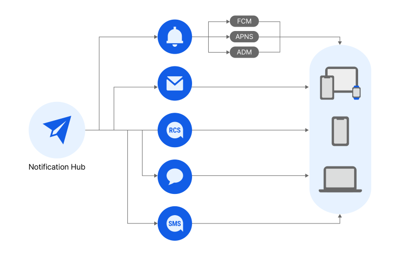

<!-- pre-align:aligned sig=caabb61efc99 -->

<h1>Notification Hub Overview</h1>

**Notification > Notification Hub > Overview**

It is a cloud-based integrated messaging platform that sends and manages push, email, SMS, RCS, and AlimTalk messages. Notification Hub integrates various message channels to send and manage messages. Flow sending also allow multiple message channels to be sent sequentially in order of priority. By sharing settings and resources with other Notification products, existing Notification customers can quickly transition to Notification Hub.

## Main features

### Multi-channel messaging

* Sends messages to six messaging channels: SMS, Alim Talk, Branded Message, RCS, Email, and Push.
    * Uses a single API to integrate and manage multiple message channels for easy sending.

### Address book

* Organizes your recipients' contacts (email, phone number, token).
    * Allows you to manage recipients in groups.
    * Allows you to prevent unnecessary sending by managing opt-out records.

### Template

* Allows you to register and manage templates for all message channels.
    * With templates, you can reduce repetitive message creation and make it easy to send out messages consistently.

### Flow

* Allows you to create a flow using pre-registered templates.
    * Sends messages simultaneously to a maximum of 6 channels with a flow, and automatically sends messages to the next channel in the preset send order when a message fails to be received due to device status.
    * You can use this feature for various purposes, such as increasing delivery rates or reducing sending costs, depending on how you set the priority of message channels.

### Mass delivery

* Allows you to send messages to multiple recipients at once.
    * Recipient file upload
        * Uploads an Excel file with a list of recipients for sending.
        * Distinguishes between valid and invalid recipients in the uploaded Excel file.

## Guide to sharing resource and feature settings between Notification Services

* The resource and feature settings of NHN Cloud Notification's Push, SMS, RCS Bizmessage, KakaoTalk Bizmessage, and Email services are shared with the Notification Hub service. (For example, when SMS service registers a sender number, the sender number is shared by Notification Hub service.)
Existing NHN Cloud Notification users can easily switch to and use the Notification Hub service.
  * Sharing items
    * Resource
      * Address book
      * Sender information
      * Statistics Key
      * Identity verification
    *  Feature setting
      * Detailed settings (by message channel)

## Delivery volume Limit Guidance

* Some message channels limit the volume of delivery.
  * SMS
    * SMS limits the number of deliveries to 5,000 per month per organization.
      * Regardless of the type of delivery (SMS, LMS, MMS), it is calculated by summing both SMS and Notification Hub services.
      * Calculate the delivery volume based on delivery.
  * AlimTalk
    * AlimTalk limits the delivery volume to 1,000 per project per day.
* Monthly delivery volume can be seen in **Console**>**Organization**>**Project**>**Quarter Management**.
* Contact **Customer Center**>**1:1:1 Inquiry** if you need to adjust your monthly delivery volume.
  * [1:1 Inquiry Shortcut](https://www.nhncloud.com/kr/support/inquiry)
* For resource provision policies, see **User Guide**>**NHN Cloud**>**Resource Provision Policy**.
  * [ Resource Provision Policy Shortcut ](https://docs.nhncloud.com/ko/nhncloud/ko/resource-policy/)

## Information on Processing of Personal Information

In the process of using the Notification Hub service, customers can collect the user's personal information. Therefore, customers who use this service must inform users of legal notices and obtain consent in accordance with the Personal Information Protection Act.
In addition, this process may result in a consignment relationship between the customer and NHN Cloud regarding the processing of personal information. Customers in the position of a consignor can enter into a separate written consignment contract with the consignee, NHN Cloud, and can refer to the following information to notify the personal information processing policy operated by the customer.

* Consignee: NHN Cloud Corp.
* Contents of consignment work: Notification Hub service provision work

## Terms and Conditions

* [Notification Terms and Conditions Shortcut](https://kr1-0lodw5frr5-real.api.nhncloudservice.com/popup/terms)
