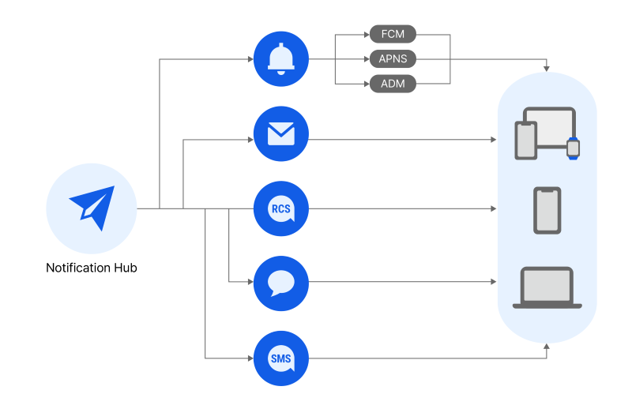

<h1>Notification Hub概要</h1>

**Notification > Notification Hub > 概要**

SMS、お知らせトーク、カカともへのメッセージ、 RCS、Email、Pushメッセージを送信・管理するクラウド基盤統合メッセージングプラットフォームです。 Notification Hubは様々なメッセージチャンネルを統合してメッセージを送信し、管理できます。また、フロー送信により、複数のメッセージチャンネルを優先順位に応じて順次送信できます。 Notificationの他の商品との設定とリソースを共有することで、既存のNotificationのお客様がNotification Hubに素早く移行できます。

## 主な機能

### マルチチャンネルメッセージング

* SMS、お知らせトーク、カカともへのメッセージ、 RCS, Email, Pushの6つのメッセージチャンネルでメッセージを送信できます。
    * 様々なメッセージチャンネルを1つのAPIで統合管理し、簡単にメッセージを送信できます。

### アドレス帳

* 受信者の連絡先(メール、携帯電話番号、トークン)を体系的に管理できます。
    * 受信者をグループで管理できます。
    * 受信者が受信拒否した履歴を管理し、不要なメッセージの送信を防止できます。

### テンプレート

* 全てのメッセージチャンネルのテンプレートを登録及び管理できます。
    * テンプレートを使用することで、反復的なメッセージの作成を減らし、一貫性のあるメッセージを簡単に送信できます。

### フロー

* 事前に登録したテンプレートでフローを作成できます。
* フローを利用して最大6つのチャンネルに同時にメッセージを送信することができ、端末の状態によりメッセージの受信に失敗した場合、事前に設定した送信順序に従って次の順番のチャンネルに自動送信できます。
    * メッセージチャンネルの優先順位の設定方法により、受信率を高めたり、送信コストを節約するなど、様々な目的に使用できます。

### 大量送信

* メッセージを複数の受信者に一度に送信できます。
    * 受信者ファイルアップロード
        * 受信者リストが保存されたExcelファイルをアップロードしてメッセージを送信できます。
        * アップロードされたExcelファイルの有効な受信者と有効ではない受信者を区分します。

## Notificationサービス間のリソースと機能設定の共有案内

* NHN Cloud NotificationのPush, SMS, RCS Bizmessage, KakaoTalk Bizmessage, Emailサービスのリソース及び機能設定履歴がNotification Hubサービスと共有されます。 (例：SMSサービスで発信番号を登録すると、 Notification Hubサービスでその発信番号が共有される)
 既存NHN Cloud NotificationユーザーはNotification Hubサービスに簡単に切り替えて利用できます。
* 共有項目
    * リソース
        * アドレス帳
        * 発信情報
        * テンプレート(ただし、テンプレートのカテゴリーは共有されません。)
        * 統計キー
        * 本人認証
    * 機能設定
        * (メッセージチャンネル別)詳細設定

## 送信量制限案内

* 一部のメッセージチャンネルで送信量を制限しています。
    * SMS
        * SMSは、組織ごとに月5,000件に送信量を制限しています。
            * 送信タイプ(SMS、LMS、MMS)に関係なく、SMSとNotification Hubサービスの送信量を全て合算して計算します。
            * 送信基準で送信量を計算します。
    * お知らせトーク/カカともへのメッセージ
        * お知らせトーク/カカともへのメッセージは、プロジェクトごとに1日1,000件に制限されます。
* 月間送信量は、**コンソール** > **組織** > **プロジェクト** > **クォーター管理** メニューで確認可能です。
* 月間送信量の調整が必要な場合、**サポート** > **1:1お問い合わせ**にお問い合わせください。
    * [1:1お問い合わせ](https://www.nhncloud.com/kr/support/inquiry)
* リソース提供ポリシーは **ユーザーガイド** > **NHN Cloud** > **リソース提供ポリシー**を参照してください。
    * [リソース提供ポリシー](https://docs.nhncloud.com/ko/nhncloud/ko/resource-policy/)

## 個人情報処理に関するご案内

Notification Hubサービスを利用する過程で、顧客は利用者の個人情報を収集できます。したがって、本サービスを利用する顧客は、個人情報保護法に基づき、利用者に法的告知事項を通知し、同意を得なければなりません。
また、この過程で、顧客とNHN Cloudの間で個人情報処理に関する業務委託関係が発生する場合があります。委託者の地位にある顧客は、受託者であるNHN Cloudと別途書面による委託契約を締結することができ、顧客が運営する個人情報処理方針に以下の内容を参考にして告知できます。

* 委託業者: NHN Cloud (株)
* 委託業務の内容: Notification Hubサービス提供業務

## 利用規約

* [Notification利用規約](https://kr1-0lodw5frr5-real.api.nhncloudservice.com/popup/terms)
