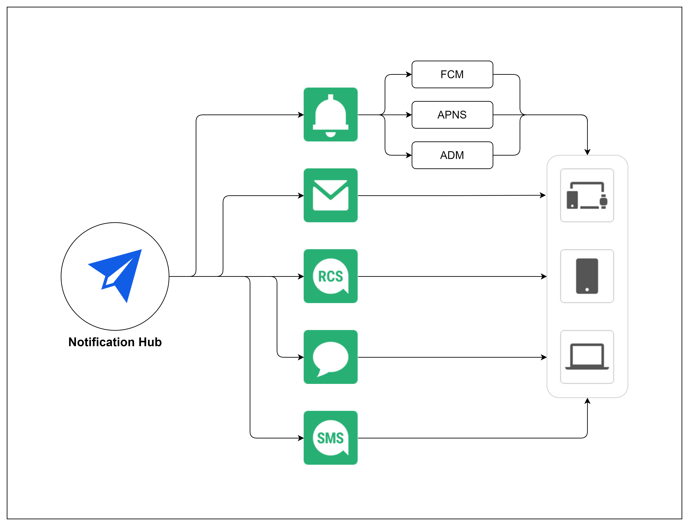

Notification Hub > 개요

# 개요

푸시, 이메일, SMS, RCS, 알림톡, 친구톡 메시지를 발송하고 관리하는 클라우드 기반 통합 메시징 플랫폼입니다. 

# 특징

## 콘솔
* 메시지 발송에 사용할 메시지 채널이 달라도 동일한 사용자 경험을 제공합니다.
* 메시지 채널 별로 페이지가 구분되어 있거나 사용 편의성을 위해 기능 단위로 묶어서 페이지를 제공합니다.
* 메시지 작성 시 수신자에게 표시될 메시지의 내용에 대한 미리 보기를 제공합니다.
* 직접 입력, 주소록에서 선택, 파일 업로드로 수신자를 추가할 수 있습니다.
* 예약 발송뿐만 아니라 승인 후 발송 기능을 제공해 원하는 시간에 메시지를 발송할 수 있습니다.
* 수신자의 연락처 단위로 수신 결과를 조회할 수 있습니다.

## 플로우 발송
* 두 개 이상의 메시지 채널의 발송 우선 순위와 템플릿을 정해 순서대로 메시지를 발송하는 기능입니다.
* 우선 순위가 빠른 메시지 채널부터 메시지를 발송하고 발송이나 수신이 실패하거나 오래 걸리면 다음 순서의 메시지 채널로 메시지를 발송합니다.
* 설정된 메시지 채널 전체로 발송하는 동시 발송과 설정된 우선 순위에 따라 발송하는 우선 순위 발송이 있습니다.
* 메시지 채널의 우선 순위 설정 방법에 따라 수신율을 높이거나 발송 비용을 절약 등 다양한 목적으로 사용할 수 있습니다.

## Notification 상품들과 설정, 자원 공유
NHN Cloud Notification의 개별 상품인 푸시, 이메일, SMS, RCS Bizmessage, KakaoTalk Bizmessage 설정과 자원이 Notification Hub에 공유됩니다. 기존 NHN Cloud Notification 고객은 빠르게 Notification Hub로 전환할 수 있습니다.

### 공유되는 설정과 자원
* 발신 정보
    * 푸시 인증서
    * 발신 번호
    * 발신 도메인
    * RCS Bizmessage 브랜드 정보
    * KakaoTalk 발신 프로필
* 템플릿 (단, 템플릿의 카테고리는 공유되지 않습니다.)
* 주소록
* 통계 키
* 상세 설정

## 첨부 파일 관리
* 콘솔에서 첨부 파일을 관리할 수 있습니다.
* 첨부 파일이 업로드 시 사용 가능한 메시지 채널을 확인할 수 있습니다.
* 첨부 파일이 메시지 채널 제약에 해당하지 않는다면 메시지 발송 시 첨부 할 수 있습니다. 

## 통계
* 다양한 기준에 대한 통계 데이터를 제공합니다.
    * 메시지 
    * 국제 문자 메시지
    * 연락처 등록
    * 수신 거부
* 특히 메시지 통계 기준은 한 번에 전체 메시지 채널에 대한 통계 데이터를 조회할 수 있습니다.

### 통계 기준에 따른 이벤트

| 통계 기준 | 이벤트 | 설명 |
| - | - | - |
| 메시지 | 요청 됨(REQUESTED) 취소 됨(CANCELED) 발송 성공(SENT) 발송 실패(SEND_FAILED) 수신 성공(DELIVERED) 수신 실패(DELIVERY_FAILED) 열람 됨(OPENED) | 요청 됨(REQUESTED) = 취소 됨(CANCELED) + 발송 성공(SENT) + 발송 실패(SEND_FAILED) 발송 성공(SENT) = 수신 성공(DELIVERED) + 수신 실패(DELIVERY_FAILED) 

## 다양한 파일 업로드와 다운로드
* 메시지 발송을 위한 수신자 연락처 목록 업로드
* 첨부 파일 업로드
* 수신자 연락처별 수신 결과 목록 다운로드
* 주소록 연락처 목록 다운로드
* 통계 데이터 다운로드
* 수신 거부 전화번호, 이메일, 푸시 토큰 다운로드

# 용어

| 용어 | 설명 |
| - | - |
| 메시지 채널 | Notification Hub에서 발송이 가능한 메시지 프로토콜입니다. 푸시, 이메일, SMS, RCS, 알림톡, 친구톡을 지원합니다. |
| 플로우 | 메시지 채널의 발송 순서와 템플릿을 정의한 메시지입니다. |
| 템플릿 | 자주 사용하는 메시지 형식을 정의해 저장해둔 메시지입니다. |
 
