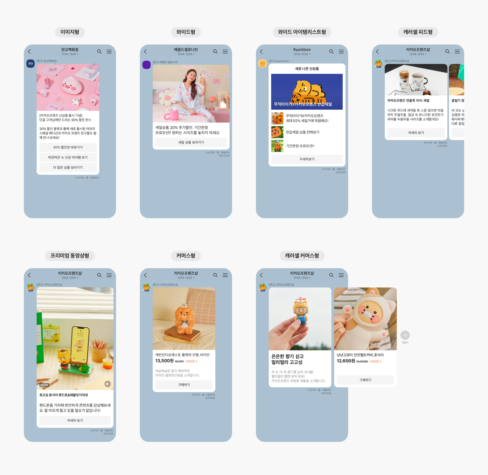

<h1>이용 정책 및 사전 설정 안내 - 알림톡, 친구톡</h1> 

**Notification > Notification Hub > 이용 정책 및 사전 설정 안내 > 알림톡, 친구톡**

## 발신 프로필 생성
카카오 정책에 따라 카카오톡 비즈 메시지를 발송하려면 먼저 카카오톡채널 관리자센터에서 비즈니스 인증을 받은 채널을 개설해야 합니다.

* [카카오 비즈니스 바로 가기](https://business.kakao.com/)
* [카카오 비즈니스 - 카카오 채널 생성 및 비즈니스 인증 가이드 바로 가기](https://kakaobusiness.gitbook.io/main/channel/start)

### 계정 및 채널 생성

다음 항목을 참고해 계정 생성 및 로그인을 진행합니다.

* 카카오 비즈니스에 접속해 로그인 페이지로 이동 후 계정을 생성합니다.
* 기업 대표 또는 공용 이메일로 가입하는 것을 권장합니다. (담당자 개인 카카오톡 계정 이메일로 로그인 가능하나, 담당자 부재/퇴사 시 채널 이관이 필요한 경우가 발생)

다음 항목을 참고해 채널을 생성합니다.

* 채널 이름은 채널 홈에 노출되는 이름으로, 채널명과 사업자등록증의 법인명이 동일하게 설정합니다. 사업 분야와 관련없는 이름은 ‘비즈니스 채널’ 전환의 심사 단계에서 반려 사유가 될 수 있습니다.
* 검색용 아이디는 카카오톡 앱에서 검색 시 표시되는 아이디입니다. 한 번 설정된 검색용 아이디는 변경이 불가합니다.
* 프로필 사진은 채널 등록 이후에도 설정하실 수 있습니다.

### 카카오톡 채널 설정
채널 개설 완료 후 아래 항목을 참고해 채널 정보를 설정하고 비즈니스 채널을 신청합니다.

1. 카카오톡 채널 관리자센터에서 개설된 채널을 선택합니다. 채널 공개와 검색 허용을 'ON'으로 설정합니다.

2. 비즈니스 채널 전환을 신청합니다. 모든 내용을 첨부/ 입력한 뒤 신청을 완료하면, 심사를 통해 전환 여부가 결정됩니다. (카카오에서 심사하며 영업일 기준 2~3일 소요됩니다.)
    * 사업자등록증 및 재직증명서(대표자 신분증), 업종별 제출 서류 등이 필요합니다.
    * 서류 제출 시 반드시 개인정보 마스킹 가이드를 참고하시기 바랍니다. 마스킹 누락 시 심사가 반려됩니다.
    * 통신판매업, 의료기기판매업, 건강기능식품판매업의 경우 신고증을 첨부합니다.
    * 입력한 비즈니스 정보의 기업명과 채널 이름이 다를 경우 심사에 참고할 자료를 첨부합니다.

### 카카오톡 채널 등록
비즈니스 채널 전환이 완료(승인)되었다면, **Notification Hub** > **발신 정보** > **발신 프로필 관리** 탭에서 발신 프로필(카카오톡 채널)을 등록합니다. 발신 프로필 등록에 대한 자세한 내용은 **콘솔 사용 가이드** > **발신 정보** > **발신 프로필 관리**에서 확인할 수 있습니다.

## 주의 사항
알림톡 이용 시 고객사는 다음과 같은 서비스 이용 유의 사항을 수신자에게 안내해야 합니다.

* 알림톡을 수신하는 과정에서 와이파이 환경이 아닌 경우, 데이터 통신 요금이 발생할 수 있습니다.
* 알림톡 수신을 원하지 않을 경우에 대해 다음의 내용을 참고하세요.
  * 발신자의 연락처(고객센터 등)를 통하여 발신자에게 수신 거부 의사를 전달할 수 있도록 안내해야 합니다.
  * 알림톡이 수신된 채팅방의 상단 레이어에서 [알림톡 차단]을 선택하여 발신자를 차단할 수 있습니다.

## 알림톡과 친구톡 비교

| 구분    | 알림톡                                    | 친구톡                                                                                 |
| ----- |----------------------------------------|-------------------------------------------------------------------------------------|
| 발송 내용 | 정보성 메시지 발송 가능                          | 광고성 메시지 발송 가능                                                                       |
| 발송 대상 | 친구 여부 관계없음(전화번호 정보 필요)                 | 카카오톡 채널과 친구를 맺은 이용자(전화번호 정보 필요)                                                     |
| 발송 형식 | 텍스트형 이미지형                           | 텍스트형 이미지형 와이드 이미지형 와이드 아이템 리스트형 캐러셀피드형 프리미엄 동영상형 커머스형 캐러셀 커머스형 |
| 특이 사항 | - 정보형 비즈 메시지에 국한 - 승인된 템플릿 기반으로 발송 | - 야간 발송 제한(20:50~다음 날 08:00)                                                        |

### 친구톡 발송 지원 타입

|구분	| 설명                                                                                                                                                                                                                                                                                                 | 카카오 이미지 업로드 규격 |
|-- |----------------------------------------------------------------------------------------------------------------------------------------------------------------------------------------------------------------------------------------------------------------------------------------------------| --|
|텍스트	| 최대 1,000자 텍스트+링크 버튼 최대 5개                                                                                                                                                                                                                                                                        | 해당 없음 |
|이미지	| 최대 400자 텍스트+이미지 1장+링크 버튼 최대 5개                                                                                                                                                                                                                                                                 | </li><li> 제한 사이즈 - 가로 500px 이상, 가로:세로 비율 2:1 이상 3:4 이하</li><li>파일 형식 및 크기: JPG, PNG/최대 5MB |
|와이드 이미지	| 최대 76자 텍스트+와이드 이미지 1장+링크 버튼 최대 2개                                                                                                                                                                                                                                                              | </li><li> 제한 사이즈 - 가로 800px, 세로 600px</li><li>파일 형식 및 크기: JPG, PNG/최대 5MB |
|와이드 아이템 리스트| 	텍스트+아이템 리스트 이미지+링크 버튼 최대 2개(가로 정렬) <li>최대 4개/최소 3개의 아이템 리스트가 필요합니다.</li><li>텍스트 문구는 첫 번째 아이템은 25자, 2~4번째 아이템은 30자로 제한됩니다.</li><li>광고 발송만 가능합니다.</li>                                                                                                                                       | </li><li> 아이템 리스트 개수에 맞춰 최소 3장, 최대 4장 이미지를 업로드해 사용합니다.</li><li>제한 사이즈 - 가로 400px, 세로 400px~가로 800px, 세로 400px</li><li>비율 및 가로 픽셀 확인 X. 섬네일 크기에 맞추어 중앙 기준으로 크롭하여 노출</li><li>파일 형식 및 크기: JPG, PNG/각 파일 최대 5MB |
|캐러셀 피드| 	캐러셀 1개당: 제목(헤더)+텍스트 문구+링크 버튼(2개/가로 배열)+캐러셀용 이미지 발송<li>최대 10개/최소 2개의 캐러셀 리스트가 필요합니다.</li><li>제목(헤더)은 20자, 텍스트 문구는 180자로 제한됩니다.</li><li>캐러셀 하나당 버튼은 최대 2개까지 가능하며 가로 정렬되어 발송됩니다.</li><li>광고 발송만 가능합니다.</li>                                                                                         | </li><li>캐러셀 리스트 개수에 맞춰 최소 2장, 최대 10장 이미지를 업로드해 사용합니다. </li><li>제한 사이즈 - 가로 500px 이상, 가로:세로 비율 2:1 이상 3:4 이하</li><li>파일 형식 및 크기: JPG, PNG/각 파일 최대 5MB |
|프리미엄 동영상| 	제목(헤더)+텍스트 문구+카카오TV에 업로드된 영상 1개+링크 버튼 최대 1개<li>동영상 링크는 카카오TV에 업로드된 영상만 사용 가능합니다(예시: https://tv.kakao.com/v/#{숫자} / https://tv.kakao.com/channel/#{숫자}/cliplink/#{숫자}).</li><li>헤더는 20자, 텍스트는 76자로 제한됩니다.</li><li>헤더와 텍스트는 선택 사항으로 없어도 발송 가능합니다.</li><li>버튼은 1개까지 발송 가능합니다.</li>                | </li><li>제한 사이즈 - 가로 500px 이상, 가로:세로 비율 2:1 이상 3:4 이하 </li><li>파일 형식 및 크기: JPG, PNG/최대 5MB |
|커머스| 	상품 제목+가격 정보+부가 정보+링크 버튼(2개/가로 배열)+커머스용 이미지 발송<li>부가 정보는 34자로 제한됩니다.</li><li>버튼은 최소 1개 이상 포함되어야 하며, 최대 2개까지 포함 가능하며 가로 정렬되어 발송됩니다.</li>                                                                                                                                                      | </li><li>제한 사이즈 - 가로 500px 이상, 가로:세로 비율 2:1 이상 3:4 이하 </li><li>파일 형식 및 크기: JPG, PNG/최대 5MB |
|캐러셀 커머스| 	캐러셀 1개당: 상품 제목+가격 정보+부가 정보+링크 버튼(2개/가로 배열)+캐러셀 커머스용 이미지 발송 <li>여러 커머스 말풍선을 캐러셀로 발송 가능합니다.</li><li>캐러셀 인트로가 존재하는 경우 캐러셀은 최소 1개 이상, 최대 10개 이하 발송 가능합니다.</li><li>캐러셀 인트로가 존재하지 않는 경우 캐러셀은 최소 2개 이상, 최대 10개 이하 발송 가능합니다.</li><li>각 캐러셀마다 버튼은 1개 필수이며 최대 2개까지 지원합니다.</li><li>광고 발송만 가능합니다.</li> | </li><li> 캐러셀 인트로+캐러셀 리스트 개수에 맞춰 최소 1장, 최대 10장 이미지를 업로드해 사용합니다.</li><li>전체 이미지 비율이 동일해야 합니다.</li><li>제한 사이즈 - 가로 500px 이상, 가로:세로 비율 2:1 이상 3:4 이하</li><li>파일 형식 및 크기: JPG, PNG/각 파일 최대 5MB |

